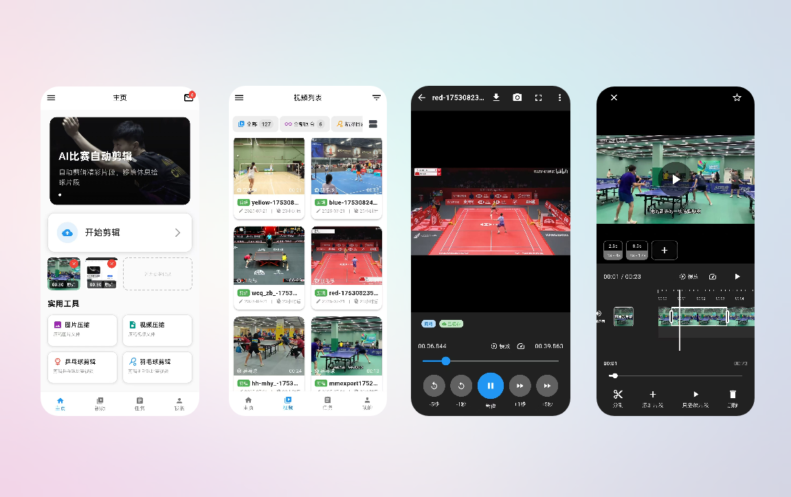

# Huji (弧迹)

<p align="center">
  
</p>

<p align="center">
  <strong>Smart video editing: auto-detect table tennis &amp; badminton rallies and clip highlights</strong>
</p>

<p align="center">
  <a href="README.md">中文</a> •
  <a href="#overview">Overview</a> •
  <a href="#features">Features</a> •
  <a href="#project-structure">Structure</a> •
  <a href="#quick-start">Quick Start</a> •
  <a href="#community">Community</a> •
  <a href="#license">License</a>
</p>

[](LICENSE)

## Overview

<p align="center">
  
</p>

Huji is a smart video-editing Android app. It automatically detects exciting rallies in table tennis and badminton matches, removes dead time (e.g. ball pickup), and outputs condensed highlight reels.

## Features

- [x] **Match video clipping**: clip existing videos / clip while recording
- [x] **Auto-clip config & execution**: cloud or on-device detection, upload, streaming clip progress
- [x] **Clip while recording**: real-time rally detection and clip generation during capture
- [x] **Rally editor**: multi-segment preview, drag-and-drop reorder, add/remove/edit rallies, export quality & save
- [x] **Rally picker**: select which detected rallies to keep
- [x] **Post-clip editing**: basic edits on generated segments (lightweight editor)
- [x] **Video list**: feed/list toggle, filters, profile & settings entry
- [x] **Tasks & history**: local clip tasks tab, video history tab, progress dialog, jump to rally editor
- [x] **Clip progress**: per-task progress display and overlay
- [x] **Video record detail**: single-record detail view

### Supported video types

- [x] **Table tennis match videos**
- [x] **Badminton match videos**

### Clip speed

PC (RTX 4050):

- Algorithm: ~69.53s to clip a 16-minute video

Android: not benchmarked yet

## Project structure

| Subproject | Stack | Description |
| ---------- | ----- | ----------- |
| `huji-app` | Flutter | Huji client — video pick, smart clip, segment edit, task management |
| `huji-algorithm` | Python | Algorithm service (Git submodule) — table tennis/badminton detection & auto-clip |

`huji-algorithm` is included as a Git submodule: [hhoao/huji-algorithm](https://github.com/hhoao/huji-algorithm).

## Quick start

### Clone the repo

Clone with submodules on first checkout:

```bash
git clone --recurse-submodules https://github.com/hhoao/huji.git
```

If you already cloned the main repo, initialize submodules:

```bash
git submodule update --init --recursive
```

### Desktop Linux dependencies

```bash
sudo apt-get install -y libasound2-dev libmpv-dev mpv
```

### huji-app (client)

```bash
cd huji-app
flutter pub get
flutter run
```

### huji-algorithm (Python)

`cd huji-algorithm`

#### Local quick clip (recommended)

**Linux / macOS**

```bash
./setup.sh
source .venv/bin/activate

python main.py --video-path videos/demo.mp4 --sport ping_pong
python main.py -v src/resources/video/examples/test.mp4 --sport badminton --match-type doubles
```

**Windows (PowerShell)**

```powershell
.\setup.ps1
.venv\Scripts\activate

python main.py --video-path videos\demo.mp4 --sport ping_pong
```

Install [FFmpeg](https://ffmpeg.org/) and add it to `PATH`. See [huji-algorithm/README.en.md](huji-algorithm/README.en.md) for more Windows notes.

#### Service mode (Kafka + HTTP)

```bash
cd docker/dev && docker compose up -d
python main.py --serve
```

Common CLI flags:

| Flag | Description |
| ---- | ----------- |
| `--video-path` / `-v` | Local video file path |
| `--sport` | `ping_pong` or `badminton` |
| `--match-type` | Badminton: `singles` (default) / `doubles` |
| `--output-dir` / `-o` | Output directory (overrides config) |
| `--serve` | Start Kafka + HTTP service |
| `--train` | Train models |

More details: [huji-algorithm/README.en.md](huji-algorithm/README.en.md).

## Community

- **QQ Group**: 112856301
- **Discord**: [Join our server](https://discord.com/channels/1518551459053178960/1518551461242474558)

## License

[GNU Affero General Public License v3.0](LICENSE)
