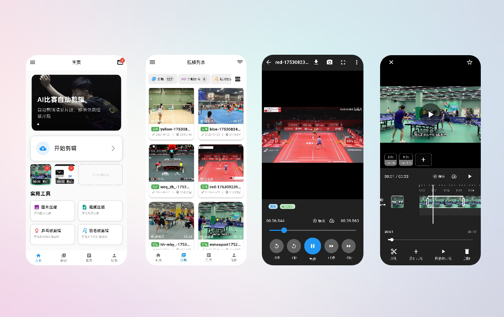

# 弧迹 (Huji)

<p align="center">
  
</p>

<p align="center">
  <strong>智能视频剪辑：自动识别乒乓球、羽毛球比赛并剪辑精彩片段</strong>
</p>

<p align="center">
  <a href="#概述">概述</a> •
  <a href="#主要功能">主要功能</a> •
  <a href="#项目结构">项目结构</a> •
  <a href="#快速开始">快速开始</a> •
  <a href="#license">License</a>
</p>

[](LICENSE)

## 概述

<p align="center">
  
</p>

弧迹是一个智能视频剪辑项目，包含 Flutter 客户端与 Python 算法服务。客户端支持多平台（Android、iOS、Linux、Windows、macOS、Web），算法服务基于 YOLO 模型自动检测乒乓球、羽毛球比赛中的精彩回合，去除捡球等冗余片段，输出精简的比赛集锦。

## 主要功能

- [x] **比赛视频剪辑**：已有视频剪辑 / 边拍边剪辑
- [x] **自动剪辑配置与执行**：云端或本地检测、上传、流式剪辑进度
- [x] **边拍边剪辑**：录制同时实时检测回合并生成剪辑
- [x] **回合剪辑编辑**：多片段预览、拖拽排序、增删改回合、导出清晰度与保存
- [x] **回合选择弹窗**：从检测结果中勾选要保留的回合
- [x] **剪辑后简单编辑**：对生成视频做基础编辑
- [x] **视频列表**：Feed/列表切换、筛选、入口到个人与设置
- [x] **任务与记录**：本地剪辑任务 Tab、视频记录 Tab、任务进度弹窗、跳转回合编辑
- [x] **视频剪辑进度**：单任务进度展示与覆盖层
- [x] **视频记录详情**：单条记录详情

### 已经支持的视频类型

- [x] **乒乓球比赛视频**
- [x] **羽毛球比赛视频**

## 项目结构

| 子项目 | 技术栈 | 说明 |
| ----- | ------ | ---- |
| `restcut_app` | Flutter | 弧迹客户端，提供视频选择、智能剪辑、片段编辑、任务管理等功能 |
| `autoclip-algorithm` | Python | 算法服务，支持乒乓球单打、羽毛球单打/双打的自动检测与剪辑 |

## 快速开始

### restcut_app（客户端）

```bash
cd restcut_app
flutter pub get
flutter run
```

### autoclip-algorithm（算法服务）

```bash
cd autoclip-algorithm
./setup.sh
```

需配合 Kafka 环境，开发时可使用：

```bash
cd autoclip-algorithm/docker/dev
docker compose up -d
```

## License

[MIT](LICENSE)
